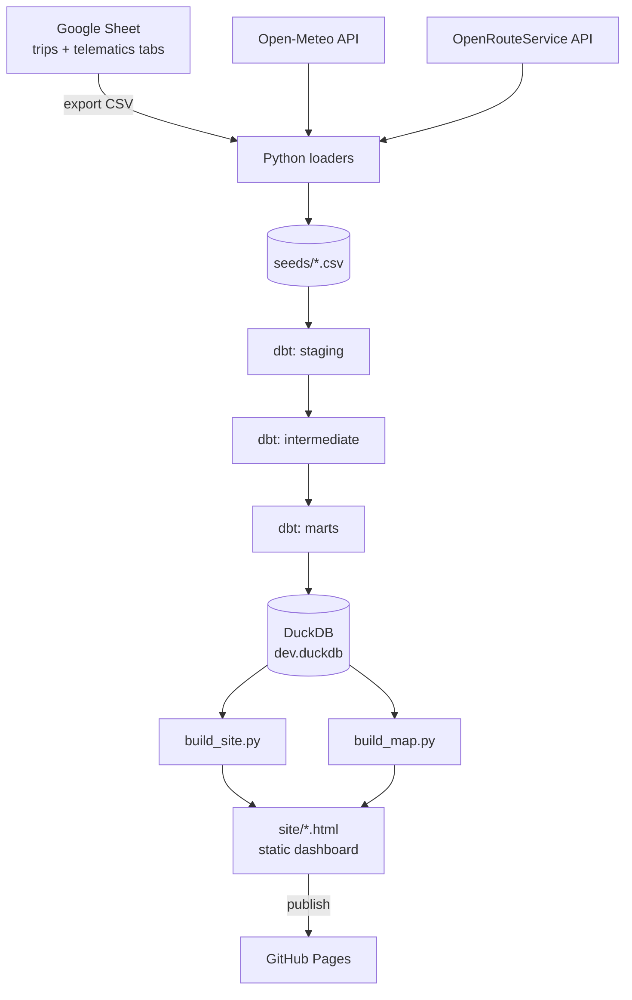

# Corolla — Driving Habits & the EV Decision

A self-contained data project that turns four years of real telematics from one Toyota Corolla
Hybrid into an honest answer to a practical question: **does replacing a paid-off, efficient
hybrid with an electric car make sense — and if the money never balances, what is the case for it?**

The whole thing runs locally and free: Python for data prep, **dbt** for modelling, **DuckDB** as
the warehouse, and a static HTML dashboard published on GitHub Pages.

---

## 1. The question, and the headline answer

Switching to an EV is tempting, but "electricity is cheaper than petrol per km" is the easy half of
the question. The honest test is whether replacing a *working, already-efficient* hybrid pays off at
all. So every real trip is costed under each candidate car, using **measured** fuel use for the
hybrid and community **real-world** figures (Spritmonitor) for the alternatives — not brochure/WLTP
numbers.

The headline metric is deliberately not "payback in years" but **euros paid per tonne of CO₂
avoided**. That reframes an EV from a financial decision into an environmental one and lets it be
compared against what carbon actually costs (~€80/tonne on the EU market).

**Result on real data:** every EV avoids CO₂ at roughly **€5,400–5,800 per tonne** — about 65–70×
the market price of carbon. The hybrid, by contrast, pays back its ~€2,500 premium over a
conventional 1.2 Turbo petrol in about **7 years**. One is an investment; the other only makes
sense on grounds other than money.

---

## 2. Architecture at a glance

Data flows in one direction: raw exports become tidy seeds, dbt models them in layers, and Python
renders the result as a static site.



The guiding idea: **one fact table costs every trip under every car and every consumption source**
(lab / community real-world / my own measured driving). Every downstream comparison — the efficiency
ladder, the green premium, the road-type fuel split — falls out of that single consistent model.

---

## 3. Tech stack

| Tool | Role | Why |
|------|------|-----|
| **dbt Core** | SQL transformation & tests | Industry-standard modelling, lineage via `ref()`, free |
| **DuckDB** | Local analytical warehouse | A single file `dev.duckdb`, zero setup, fast |
| **Python** | Data prep & rendering | Loaders, API calls, folium map, static-site generator |
| **Open-Meteo** | Per-trip historical temperature | Free historical archive, no key |
| **OpenRouteService** | Routed motorway distance | Fills the post-2024 highway gap (free key) |
| **Spritmonitor** | Real-world consumption benchmark | Community averages, more honest than WLTP |
| **GitHub Pages** | Hosting | Free static hosting straight from the repo |

---

## 4. Project layout

```
car comparison/
├── dbt_project.yml          # dbt project config
├── profiles.yml             # points dbt at the local DuckDB file
├── seeds/                   # input data as CSV (see §5)
├── models/
│   ├── staging/             # one model per raw source, light cleaning
│   ├── intermediate/        # business logic: classify, calibrate, enrich
│   └── marts/               # final tables the dashboard reads
├── scripts/                 # Python: loaders, API fetchers, site/map builders
└── site/                    # generated dashboard (index / habits / decision + map)
```

---

## 5. Data sources & seeds

Seeds are just CSVs that dbt loads as tables. They fall in two groups.

**Generated from your data (never edited by hand):**

| Seed | Produced by | Contents |
|------|-------------|----------|
| `raw_trips.csv` | `prepare_raw_trips.py` | One row per trip: endpoints, coords, distance, fuel, time |
| `raw_telematics.csv` | `prepare_telematics.py` | 2022–24 only: measured highway, speeds, harsh events |
| `trip_temperature.csv` | `fetch_temperature.py` | Per-trip temperature from Open-Meteo |
| `trip_routed_highway.csv` | `route_highway.py` | Routed total + motorway km per trip |

**Maintained by hand (reference data):**

| Seed | Contents |
|------|----------|
| `raw_cars.csv` | Each candidate car: price, battery, WLTP figure, heat pump |
| `car_consumption.csv` | Consumption per car per source (wltp / spritmonitor / actual) |
| `energy_prices.csv` | Petrol €/l and electricity €/kWh |
| `monthly_temperature.csv`, `temperature_factor_curve.csv` | Climatology fallback + EV cold-weather penalty curve |

> **Privacy:** the real trip coordinates and telematics never leave your machine — `raw_trips.csv`
> and the other personal seeds are git-ignored. Only aggregated, coordinate-free outputs are published.

---

## 6. The dbt layers

**Staging (`stg_`)** — one model per seed, just types and renames. `stg_trips`, `stg_telematics`,
`stg_cars`, `stg_car_consumption`, `stg_energy_prices`, `stg_routed_highway`, etc.

**Intermediate (`int_`)** — where the logic lives:
- `int_trips_classified` — canonicalises the home address, classifies each trip (type, region,
  cross-border), and attaches observed fuel.
- `int_trip_temperature` — measured temperature per trip, with monthly climatology as fallback.
- `int_highway_calibration_factor` — compares routed vs the car's *measured* highway over the
  2022–24 overlap and derives one calibration factor.
- `int_trip_highway` — each trip's highway km = routed motorway × calibration factor.

**Marts** — the tables the dashboard reads. Each answers one question:

| Mart | Answers |
|------|---------|
| `fct_trip_car_scenarios` | (grain) every trip × car × consumption source, costed |
| `agg_car_annual` | annual cost & CO₂ per car (drives the efficiency ladder) |
| `mart_ev_decision` | green premium €/tonne, savings, payback per EV |
| `mart_hybrid_vs_conventional` | the hybrid-vs-petrol ROI / payback |
| `mart_fuel_by_road_type` | fuel split: city vs mixed vs highway |
| `mart_driving_behaviour` | speeds, idle, harsh events, night trips (measured 2022–24) |
| `mart_monthly_habits` / `mart_driving_overview` | seasonality and top-line stats |
| `mart_highway_calibration` | measured vs routed vs calibrated highway, by month (the validation) |

**Gating:** everything that depends on routed highway is switched off by default and turned on with a
variable, so a basic build works even without the routing data:
`{{ config(enabled=var('use_routed_highway', false)) }}`. Build with routing on via
`dbt build --vars "use_routed_highway: true"`.

---

## 7. Setup from scratch

For anyone cloning this to re-use:

```powershell
# 1. Python deps
pip install dbt-duckdb requests folium

# 2. Tell dbt where its profile is (run once per terminal session)
$env:DBT_PROFILES_DIR = "."

# 3. Free API key for routed highway, from openrouteservice.org
$env:ORS_API_KEY = "your-key"
```

`profiles.yml` already points dbt at a local `dev.duckdb` — no database to install or host.

> Provide your own seeds. The repo ships small synthetic samples so `dbt build` runs out of the box;
> replace them with real data via the loaders below.

---

## 8. Running the full pipeline

In order, from the project folder:

```powershell
python scripts\prepare_raw_trips.py  "<trips-export>.csv"        # → seeds\raw_trips.csv
python scripts\prepare_telematics.py "<telematics-export>.csv"   # → seeds\raw_telematics.csv (one-time, 2022–24)
python scripts\fetch_temperature.py                              # → seeds\trip_temperature.csv
python scripts\route_highway.py                                  # → seeds\trip_routed_highway.csv  (needs ORS key)
dbt build --vars "use_routed_highway: true"                      # builds & tests everything into DuckDB
python scripts\build_map.py                                      # → site\trip_map.html   (add --offset to publish)
python scripts\build_site.py                                     # → site\index/habits/decision.html
```

Then open `site\index.html`.

---

## 9. Updating with a new year of data

When another year of trips exists (e.g. next summer), you do **not** touch the telematics step — that
data ended in 2024 and stays frozen as the calibration anchor. The new trips get their highway from
routing, calibrated by the same factor.

```powershell
# 1. Add the new trips to the Google Sheet, export the processed-trips tab
python scripts\prepare_raw_trips.py "<new-export>.csv"   # rebuilds raw_trips.csv (old + new)
python scripts\fetch_temperature.py                      # only new trips hit the API (cached)
python scripts\route_highway.py                          # only new origin/destination pairs (cached)
dbt build --vars "use_routed_highway: true"
python scripts\build_map.py            # and: python scripts\build_map.py --offset
python scripts\build_site.py
```

**What changes vs your first instinct:**
- `raw_trips.csv` is *regenerated* by the loader, not edited by hand.
- **No `prepare_telematics.py`** — there is no new telematics after 2024.
- **Add `fetch_temperature.py`** — new trips need temperatures.
- The two API scripts **cache**, so they only do work for genuinely new trips.

If you publish a portfolio case-study page with hard-coded figures, refresh those numbers from the
rebuilt marts as a final step.

---

## 10. Publishing

**The dashboard (GitHub Pages):** commit the generated `site/` folder (built with `build_map.py --offset`
so coordinates are shifted) and enable Pages on the repo.

**The portfolio case-study page:** a separate static page that reads hard-coded headline numbers and
renders them with Chart.js, plus the offset heatmap in an iframe. After a data refresh, update those
numbers to match the rebuilt marts.

---

## 11. Privacy

- Real coordinates and telematics stay local; those seeds are git-ignored.
- The home address is collapsed to a single map node.
- `build_map.py --offset` shifts every point by a fixed amount (and `--jitter` adds randomness),
  preserving the shape of the corridors while breaking the link to real addresses.
- Published marts contain no coordinates — only aggregates.

---

## 12. Honest limitations

- **Highway after 2024** is routed-and-calibrated, not measured — trustworthy in aggregate (within
  ~2–3% of measured, year by year) but noisier per trip.
- **Average speed / idle** are whole-trip figures, so stopped time is included.
- **Road-type fuel** is bucketed by each trip's dominant road type; very short cold-start trips read high.
- **Map routes** are straight lines, not road geometry.
- **Temperature region** is approximated by destination country.
- **Some prices/consumption** are list/approximate and flagged in the seeds.
- **Green premium** assumes an 8-year horizon and current German energy prices.
